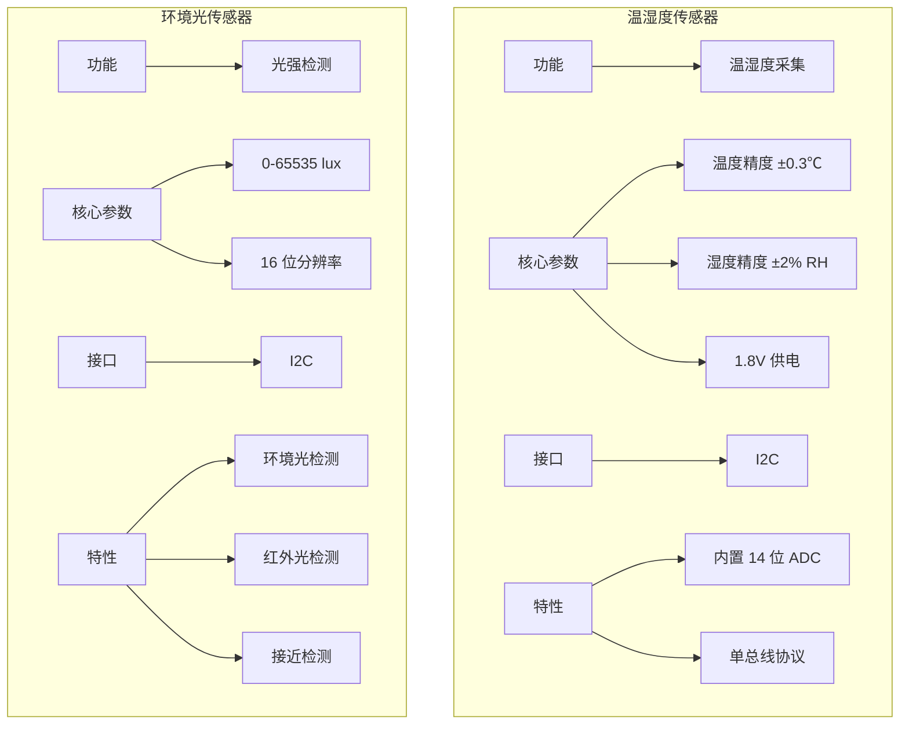
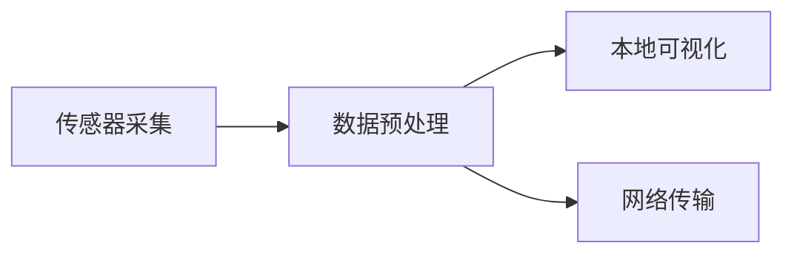
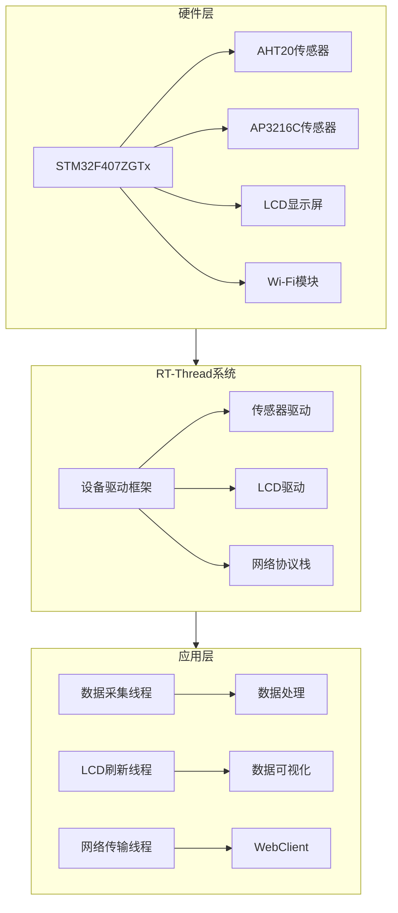

# 花灵智控 (PhytoLink)——基于 RT-Thread 的智慧花卉养护系统 🌸

## 一、项目概述
花灵智控 (PhytoLink) 是基于 RT-Thread 实时操作系统，运行于 STM32F407ZGTx 星火一号开发板的花卉智能养护方案。通过集成 AHT20 温湿度传感器与 AP3216C 环境光传感器，实现环境数据的实时采集、本地可视化显示及基于 WebClient 的网络传输，为花卉养护提供低成本、高可靠性的智能化监测方案 🌱。

## 二、核心硬件配置 🔧

### （一）核心平台
- **星火一号开发板**
- **主控**：STM32F407ZGTx（Cortex-M4 内核，168MHz 主频，支持 FPU 浮点运算）
- **集成资源**：
  - 2.4 英寸 TFT-LCD 显示屏（320×240，RGB 接口）
  - 板载 Wi-Fi 模块（支持 STA 模式）
  - 标准 I2C/I2S/USART 外设

### （二）传感器模块

### （三）硬件特性
- **即插即用**：传感器通过板载 I2C 接口直接连接，无需额外电路设计
- **显示模块**：24 位真彩色 LCD 实时显示数据，支持中文/英文界面切换

## 三、核心功能架构 🌐

### （一）数据流转流程

### （二）功能模块
1. **实时数据采集**
   - 双传感器并行采集（1Hz 频率）
   - 通过 RT-Thread 互斥锁避免 I2C 总线冲突
   - 数据预处理：滑动窗口滤波算法（窗口大小 5）去除高频噪声

2. **本地可视化**
   - LCD 显示界面包含：
     - 实时温湿度曲线（10 分钟趋势）
     - 光强柱状图（0-65535lux 量程）
     - 网络连接状态指示灯（绿色/红色）

3. **网络传输**
   - 基于 RT-Thread WebClient 组件实现 HTTP GET 上传
   - 支持参数：`http://服务器IP:端口/upload?temp=25&humi=60&light=2000`
   - 可靠性设计：5 次重试机制（间隔 1s→32s 指数退避）

## 四、软件技术实现 🛠️

### （一）RT-Thread 系统应用
- **三线程架构**：
  - 传感器采集（高优先级）
  - LCD 刷新（中优先级）
  - 网络传输（低优先级）
- 使用 RT-Thread 设备驱动框架（DFS）实现传感器标准化操作

### （二）WebClient 网络传输
- 直接调用 RT-Thread WebClient 组件，无需额外移植 MQTT 协议栈
- 支持 WPA2 加密 Wi-Fi 接入，配置 SSID/密码后自动连接

## 五、系统架构图

## 六、竞赛创新点 🌟

1. **轻量化物联网架构**
   - 无需复杂协议栈（直接使用 RT-Thread 原生 WebClient）
   - 传感器数据采集与网络传输解耦
   - 通过互斥锁保证数据一致性

2. **快速原型开发**
   - 基于成熟开发板与现成传感器模块
   - 48 小时内完成从硬件接线到网络传输的全流程调试

3. **工程化设计**
   - 完善的错误处理：
     - 传感器读取失败自动复位
     - 网络超时重试机制
   - 模块化代码结构（驱动层/业务层/接口层分离）

---

**花灵智控 (PhytoLink) 团队**  
2025 年 7 月 7 日
